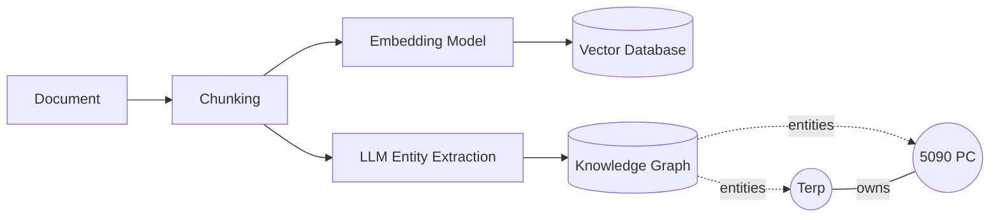
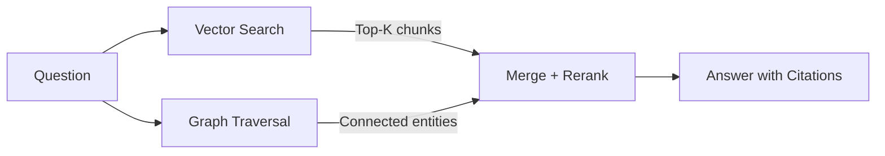
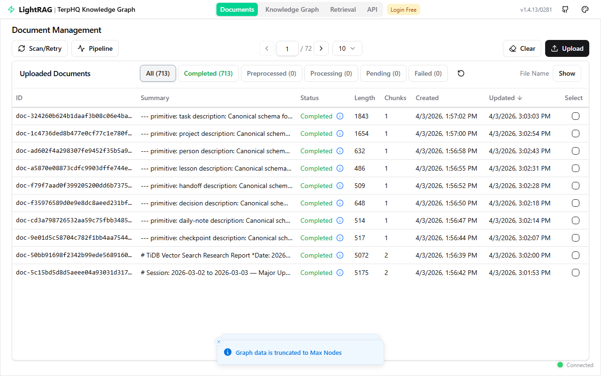
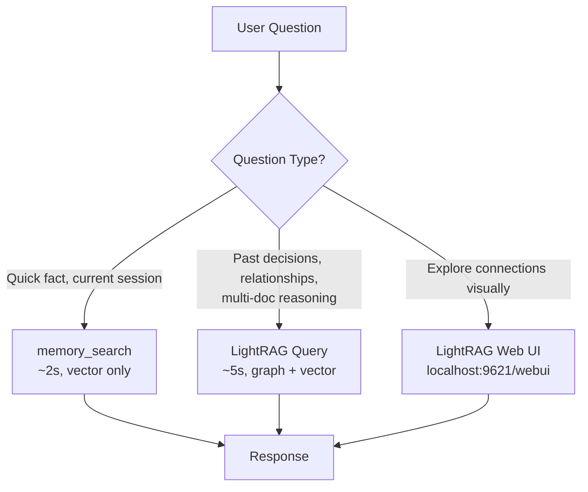

# Part 18: LightRAG — Graph RAG That Actually Works

*From "find similar text" to "reason about relationships." The single biggest intelligence upgrade you can make.*

---

> **Read this if** your vault has 500+ files, plain vector search is returning junk, or you want the agent to reason about *relationships between entities* rather than retrieving snippets.
> **Skip if** you have a small vault and vector search (Parts 4/10) is already giving you good answers.

## The Problem With Basic Vector Search

Part 4 and Part 9 gave you memory. Part 10 gave you better embeddings. But vector search has a fundamental ceiling: **it finds what's similar, not what's connected.**

Ask "what hardware decisions were made and why?" and vector search returns 8 files that all mention GPUs. It can't traverse from a decision → the person who made it → the project it affected → the lesson learned afterward. That's not a retrieval problem — it's an architecture problem.

**Graph RAG fixes this.** It builds a knowledge graph (entities + relationships) alongside your vector database, then searches both simultaneously.

### Naive RAG vs Graph RAG

| | Naive RAG (Parts 4, 9, 10) | Graph RAG (This Part) |
|---|---|---|
| **Indexes** | Text chunks as vectors | Entities, relationships, AND text chunks |
| **Retrieves** | Similar text (cosine similarity) | Connected knowledge (graph traversal + similarity) |
| **Answers** | "Here's what the docs say about X" | "Here's how X relates to Y, who decided Z, and why" |
| **Scales** | Degrades at 500+ docs (too many partial matches) | Improves with more docs (richer graph) |
| **Cost** | Cheap (embedding only) | More expensive upfront (LLM extracts entities) but cheaper at query time |

---

## LightRAG: The Best Graph RAG For Personal Use

[LightRAG](https://github.com/HKUDS/LightRAG) is an open-source graph RAG framework from HKU (EMNLP 2025 paper). It competes with Microsoft's GraphRAG at a fraction of the cost.

**Why LightRAG over alternatives:**

| Tool | Graph | Vector | Web UI | Self-Hosted | MCP/API | LangFuse | Cost |
|------|-------|--------|--------|-------------|---------|----------|------|
| **LightRAG** | ✅ | ✅ | ✅ | ✅ | ✅ REST API | ✅ Built-in | Free |
| Microsoft GraphRAG | ✅ | ✅ | ❌ | ✅ | ❌ | ❌ | 10-50x more |
| Graphiti + Neo4j | ✅ | ❌ (separate) | ❌ (Neo4j browser) | ✅ | ❌ (build your own) | ❌ | Free but manual |
| Plain vector search | ❌ | ✅ | ❌ | ✅ | ✅ | ❌ | Free |

LightRAG does vector DB + knowledge graph **in parallel** during ingestion. One system, both capabilities.

---

## How It Works

### Ingestion



For each document, LightRAG:
1. Chunks the text and embeds it (standard vector RAG)
2. Uses an LLM to extract **entities** (people, tools, projects, concepts) and **relationships** (who decided what, what depends on what)
3. Stores both in parallel — vectors for similarity, graph for structure

### Query (Dual-Level Retrieval)



Four query modes:
- **naive** — vector search only (like basic RAG)
- **local** — entity-focused (specific facts about a thing)
- **global** — relationship-focused (how things connect across documents)
- **hybrid** — both local + global (best default)

---

## What It Looks Like

> LightRAG Web UI showing 713 vault files ingested, all completed. Each document gets entity extraction, chunking, and knowledge graph integration.



---

## Setup

### Install

```bash
# Python package
pip install "lightrag-hku[api]"

# Or with Docker
git clone https://github.com/HKUDS/LightRAG.git
cd LightRAG
cp env.example .env  # Configure, then:
docker compose up
```

### Configure the .env

LightRAG needs three things: an LLM for entity extraction, an embedding model, and storage.

```env
# LLM — use any OpenAI-compatible API
LLM_BINDING=openai
LLM_MODEL=your-model-here
LLM_BINDING_HOST=https://your-api-endpoint/v1
OPENAI_API_KEY=your-key

# Embedding — local is best (fast, free, private)
EMBEDDING_BINDING=openai
EMBEDDING_MODEL=your-embedding-model
EMBEDDING_BINDING_HOST=http://127.0.0.1:your-port/v1

# Server
HOST=0.0.0.0
PORT=9621
```

**Model recommendations for entity extraction:**
- LightRAG recommends 32B+ parameter models for good extraction quality
- Use the fastest provider you have — entity extraction is high-volume but not complex
- Don't use reasoning models for indexing (waste of compute) — save smart models for query time
- Any OpenAI-compatible endpoint works (Cerebras, Groq, OpenRouter, local Ollama)

**Embedding recommendations:**
- Use your existing local embedding server if you have one (Part 10)
- If not, `text-embedding-3-large` (OpenAI) or `BAAI/bge-m3` (local via Ollama/vLLM) work well
- **Must use the same embedding model for indexing AND querying**

### Launch

```bash
lightrag-server
# Web UI at http://localhost:9621/webui
# API at http://localhost:9621
```

---

## OpenClaw Integration

> ⚠️ **We're OpenClaw, not Claude Code.** Don't configure MCP servers or JSON config files. We integrate via OpenClaw skills that call the LightRAG REST API.

### Querying from an Agent

Create a skill or use direct exec calls:

```powershell
# Query the knowledge graph (PowerShell)
$headers = @{
    "X-API-Key" = "your-api-key"
    "Content-Type" = "application/json"
}
$body = '{"query":"What decisions were made about embeddings?","mode":"hybrid"}'
Invoke-RestMethod -Uri "http://localhost:9621/query" -Method POST -Headers $headers -Body $body
```

```bash
# Query the knowledge graph (bash/curl)
curl -X POST http://localhost:9621/query \
  -H "X-API-Key: your-api-key" \
  -H "Content-Type: application/json" \
  -d '{"query":"What decisions were made about embeddings?","mode":"hybrid"}'
```

### Uploading Documents

```powershell
# Upload text via API
$body = '{"text":"Your document content here","description":"vault/decisions/my-decision.md"}'
Invoke-RestMethod -Uri "http://localhost:9621/documents/text" -Method POST -Headers $headers -Body $body
```

### Batch Ingestion Script

For uploading hundreds of vault files, write a script that:
1. Iterates through vault/*.md files
2. Reads each file as text
3. POSTs to `/documents/text` with the content + filename as description
4. Tracks progress (save state to skip already-uploaded files on re-run)
5. Small delay between uploads (~0.5s) to not overwhelm the server

At ~3 seconds per file with a fast LLM provider, 700 files takes ~35 minutes.

### The 4 Essential Skills (from Chase AI)

Create OpenClaw skills for these four operations:

| Skill | API Endpoint | When To Use |
|-------|-------------|-------------|
| **Query** | `POST /query` | Ask questions about your knowledge base |
| **Upload** | `POST /documents/text` | Add new documents after vault writes |
| **Explore** | `GET /graph` or Web UI | Browse entities and relationships |
| **Status** | `GET /health` | Check what's ingested, pipeline status |

### Integration with Existing Memory

LightRAG **complements** your existing memory system — it doesn't replace it:



1. **memory_search** (fast, vector-only) → first pass for simple lookups
2. **LightRAG query** (graph + vector) → when you need relationships or memory_search returns weak results
3. **Web UI** (visual) → when you want to explore the knowledge graph visually

---

## When To Use LightRAG vs Standard Memory

| Scenario | Use |
|----------|-----|
| Quick fact lookup ("what's the 5090 IP?") | memory_search |
| Relational query ("what projects use Neo4j?") | LightRAG (hybrid mode) |
| Multi-hop reasoning ("what lessons came from the embedding migration?") | LightRAG (global mode) |
| Session-specific context | memory_search (session files) |
| Exploring connections you didn't know existed | LightRAG Web UI |
| Under 100 documents | memory_search is probably fine |
| 500+ documents | LightRAG significantly better |

**The threshold:** Around 500-2000 pages of documents, graph RAG becomes clearly better than vector-only search — both in quality and cost (RAG queries are cheaper than feeding everything into context).

---

## Advanced: Adding a Reranker

A reranker dramatically improves retrieval quality by re-scoring results after initial retrieval:

```
Query → Initial retrieval (top 50) → Reranker (re-scores) → Final results (top 5)
```

LightRAG supports rerankers natively. If you have a local reranker server:

```env
RERANK_BINDING=cohere  # works for any OpenAI-compatible rerank API
RERANK_MODEL=your-reranker-model
RERANK_BINDING_HOST=http://127.0.0.1:your-reranker-port/rerank
```

Small reranker models (cross-encoder/ms-marco-MiniLM-L-6-v2) use ~50MB VRAM and add 20-40% better relevance. Worth it if you have any GPU headroom.

---

## Advanced: Neo4j Backend

By default LightRAG uses NetworkX (in-memory graph). For larger deployments or persistent graph storage, switch to Neo4j:

```env
GRAPH_STORAGE=Neo4JStorage
NEO4J_URI=bolt://localhost:7687
NEO4J_USERNAME=neo4j
NEO4J_PASSWORD=your-password
```

Neo4j Community Edition is free and runs in Docker (~500MB RAM, zero GPU).

---

## Advanced: RAG-Anything (Multimodal)

LightRAG handles text and PDFs. For images, tables, charts, and mixed documents, add [RAG-Anything](https://github.com/HKUDS/RAG-Anything) — from the same team, plugs directly on top of LightRAG.

---

## Results

After ingesting a vault of 700+ files (decisions, lessons, projects, people, research):

| Query Type | Vector-Only | LightRAG (Hybrid) |
|-----------|-------------|-------------------|
| "What hardware decisions were made?" | Returns 3-5 files mentioning GPUs | Returns a synthesized answer covering B200, H200, and 5090 decisions with reasoning |
| "How does Terp's embedding setup work?" | Returns embedding server config files | Returns the full chain: model choice → server setup → integration → lessons learned |
| "What failed and why?" | Random mix of error files | Connected chain: failure → root cause → fix → lesson extracted |

The difference is most visible on **relational queries** — anything that requires connecting information across multiple documents.

### Real Side-by-Side (Actual Production Test)

**Question:** "What embedding system do we use and how has it changed over time?"

**Vector-only (memory_search):** Returned 6 snippets — one about Cerebras speed research, one about a clipper vision project, one about tool-augmented agents, one about a Cerebras speed breakthrough, and two completely unrelated files. None answered the question. Total: useless.

**LightRAG (hybrid mode):** Returned a coherent narrative: started with nomic-embed-text on Ollama → upgraded to Qwen3-VL-Embedding-8B → migrated to Qwen3-Embedding-8B (non-VL) → moved from 5090 to 5080 → INT8 quantized at ~8GB VRAM → 4096 dims, 45ms latency, zero cost. Full migration story with reasoning at each step. Cited 5 vault sources.

**Verdict:** Not even close. For any question that requires connecting information across documents, LightRAG is a different league.

---

## Checklist

- [ ] `pip install "lightrag-hku[api]"` or Docker deployment
- [ ] `.env` configured with LLM + embedding endpoints
- [ ] `lightrag-server` running (port 9621)
- [ ] Vault files uploaded via batch script or Web UI
- [ ] OpenClaw skill created for query/upload (exec-based, NOT MCP config)
- [ ] Web UI bookmarked: `http://localhost:9621/webui`
- [ ] (Optional) Reranker configured for better retrieval quality
- [ ] (Optional) Neo4j backend for persistent graph storage
