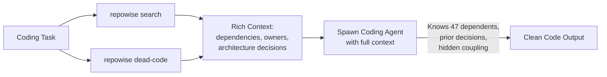

# Part 19: Repowise — Codebase Intelligence for Coding Agents

*60% fewer tokens. 4x faster. Your coding agents stop guessing and start knowing.*

---

> **Read this if** your coding agents burn tokens re-reading the same files every spawn, or you work in a large monorepo where "read the whole repo" isn't viable.
> **Skip if** you're coding in a small repo or the language-server integration in your IDE is already feeding the agent enough structure.

## The Problem

When a coding agent (Codex, Claude Code, any sub-agent) works on a large codebase, it **greps blindly.** It reads files one by one hoping to find what's relevant. It doesn't know:

- Which files are most critical (47 dependents vs 0)
- Who owns what code (and who to flag for review)
- Why code is structured a certain way (architectural decisions)
- What files change together (hidden coupling without import links)
- What code is dead and safe to delete

On a 3,000-file codebase, a coding agent without Repowise: **30 file reads, 8 minutes, missed hidden coupling, shipped broken code.**

With Repowise: **5 CLI calls, 2 minutes, found every dependency, flagged the right reviewer, confirmed no prior decisions existed.**

---

## What Repowise Does

[Repowise](https://github.com/repowise-dev/repowise) indexes your codebase into **four intelligence layers:**

### 1. Dependency Graph
Tree-sitter parses every file into symbols. NetworkX builds a full dependency graph — files, classes, functions, imports, inheritance, call relationships. PageRank identifies your most central code. Community detection finds logical modules even when your directory structure doesn't reflect them.

### 2. Git Intelligence
500 commits of history turned into signals:
- **Hotspot files** — high churn × high complexity (where bugs live)
- **Ownership percentages** — per engineer, per file
- **Co-change pairs** — files that change together without an import link (hidden coupling)
- **Bus factor** — files owned >80% by a single person (knowledge risk)

### 3. Auto-Generated Documentation
LLM-generated wiki for every module and file, rebuilt incrementally on every commit. Coverage tracking, freshness scoring, semantic search.

### 4. Architectural Decisions
The layer nobody else has. Captures **why** code exists — decisions extracted from git history, inline markers, and explicit CLI. Linked to the graph nodes they govern, tracked for staleness as code evolves.

---

## Setup

```bash
pip install repowise

# Index a project (graph + git analysis, no LLM needed)
repowise init --path /your/project --index-only

# Full index with doc generation (needs an LLM)
# Set OPENAI_BASE_URL and OPENAI_API_KEY for your preferred provider
repowise init --path /your/project
```

**First index:** ~25 minutes for a 3,000-file project (one-time cost).
**Incremental updates:** <30 seconds after each commit.

### LLM Configuration for Doc Generation

Repowise uses any OpenAI-compatible API for documentation generation:

```bash
# Use any fast, capable model
export OPENAI_BASE_URL="https://your-api-endpoint/v1"
export OPENAI_API_KEY="your-key"
repowise init --path /your/project
```

The `--index-only` flag skips LLM doc generation and just builds the graph + git analysis layers — which is the most valuable part and costs $0.

---

## OpenClaw Integration

> ⚠️ **We're OpenClaw, not Claude Code.** Use the Repowise CLI via exec commands, not MCP config files.

### Before Any Coding Task

```powershell
# Check project is indexed
exec: repowise status --path <project_path>

# Search the codebase
exec: repowise search "rate limiting" --path <project_path>

# Find dead code
exec: repowise dead-code --path <project_path>
```

### The Pattern: Repowise → Then Coding Agent



1. **Always query Repowise BEFORE spawning a coding agent**
2. Include Repowise output in the agent's task description
3. The coding agent starts with full context instead of blind grepping

```
# Example workflow
Agent reads: repowise search "authentication" → finds auth.ts has 47 dependents
Agent reads: repowise dead-code → finds 4 files safe to delete
Agent spawns coding sub-agent with: "auth.ts has 47 dependents, be careful. 
Also clean up these 4 dead files: [list]. Here's the architecture: [repowise output]"
```

### Create a Repowise Skill

Add `skills/repowise/SKILL.md` to your workspace. The skill should:
- Trigger BEFORE any coding task on an indexed project
- Call `repowise status` to verify the project is indexed
- Call `repowise search` with relevant queries
- Include results in coding agent task descriptions

### Nightly Updates

Set up a cron to keep indexes fresh:
```
repowise update --path /project1
repowise update --path /project2
```

Incremental updates take <30 seconds per project.

---

## Checklist

- [ ] `pip install repowise`
- [ ] `repowise init --path <project> --index-only` on active projects
- [ ] OpenClaw skill created (exec-based CLI calls)
- [ ] Coding workflow updated: Repowise BEFORE spawning coding agents
- [ ] (Optional) Nightly cron for `repowise update`
- [ ] (Optional) Full doc generation with LLM for comprehensive wiki
