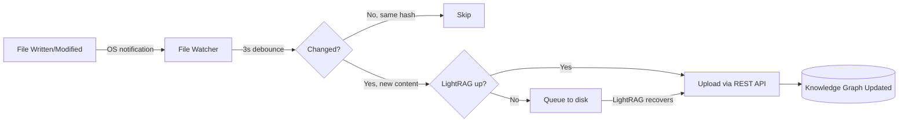

# Part 21: Real-Time Knowledge Sync — Event-Driven LightRAG Updates

*No cron. No polling. File changes hit your knowledge graph in under 6 seconds.*

---

> **Read this if** you edit vault files manually or by other agents and want LightRAG (Part 18) to pick up changes immediately instead of waiting for a cron.
> **Skip if** you don't use LightRAG, or your vault is small enough that a nightly re-index is fine.

## The Problem With Batch Ingestion

Part 18 showed you how to set up LightRAG and bulk-ingest your vault. But what happens after that? Every new vault file, every session memory update, every autoDream consolidation — none of it reaches your knowledge graph until you manually re-run the ingestion script.

Most guides tell you to set up a cron job that polls every 5-30 minutes. That's lazy engineering:
- **Wastes resources** — checking 700+ files for changes every 5 minutes when maybe 1 changed
- **Always stale** — at best your knowledge is 5-30 minutes behind reality
- **Fragile** — cron fails silently, nobody notices for days
- **Dumb** — the OS already knows when files change. Why poll?

## The Fix: Event-Driven File Watcher

Instead of asking "did anything change?" every N minutes, we tell the OS: "notify me the instant something changes." Zero CPU when idle. Reacts in milliseconds.



### Features Built In

| Feature | Why It Matters |
|---------|---------------|
| **Event-driven** | OS filesystem notifications via [watchdog](https://pypi.org/project/watchdog/). Zero CPU when idle. |
| **Debouncing** | Waits 3 seconds after the last change before uploading. Handles editors that rapid-save. |
| **Deduplication** | MD5 hash tracking. If content didn't actually change, skip the upload. |
| **Retry with backoff** | Failed uploads retry 3× with exponential backoff (2s, 4s, 8s). |
| **Self-healing** | Health monitor checks LightRAG every 60s. Auto-detects outages and recoveries. |
| **Offline queue** | When LightRAG is down, changes queue to disk. When it comes back, auto-flushes. Survives restarts. |
| **Size guards** | Skips files >100KB (noisy for graph extraction) or <50 chars (empty). |
| **Graceful shutdown** | Saves state + queue on SIGINT/SIGTERM. Nothing lost on restart. |
| **Rotating logs** | 5MB max, 3 backups. Won't fill your disk. |

### What This Means For You

Write a vault file → it's in your knowledge graph in ~6 seconds. No manual steps. No cron. No "remember to re-index."

Your autoDream writes a new consolidation? In the graph.  
Your session-memory hook saves today's work? In the graph.  
You manually create a decision file? In the graph.

---

## Setup

### Prerequisites
- LightRAG running ([Part 18](./part18-lightrag-graph-rag.md))
- Python 3.10+ with `watchdog` and `requests` installed
- `watchdog` is likely already installed if you have Repowise

### Install Dependencies

```bash
pip install watchdog requests
```

### Configure

Edit the top of `lightrag-watcher.py` to match your setup:

```python
LIGHTRAG_URL = "http://localhost:9621"      # Your LightRAG server
LIGHTRAG_API_KEY = "your-api-key"           # Your API key

WATCH_DIRS = [
    Path("/path/to/your/vault"),             # Your vault directory
    Path("/path/to/your/memory"),            # Your memory directory
]
```

### Run

```bash
# Foreground (see logs in terminal)
python lightrag-watcher.py

# Background (Windows)
start /b python lightrag-watcher.py

# Check status
python lightrag-watcher.py --status

# Manually flush offline queue
python lightrag-watcher.py --flush-queue
```

### Run as a Startup Service (Windows)

Create a scheduled task that runs at login:

```powershell
$action = New-ScheduledTaskAction -Execute "cmd.exe" -Argument '/c set PYTHONIOENCODING=utf-8 && py "C:\path\to\lightrag-watcher.py"'
$trigger = New-ScheduledTaskTrigger -AtLogon
Register-ScheduledTask -TaskName "LightRAG-Watcher" -Action $action -Trigger $trigger -Description "Real-time LightRAG sync"
```

---

## How It Works Under The Hood

### 1. Filesystem Notifications
The [watchdog](https://pypi.org/project/watchdog/) library hooks into OS-level file monitoring:
- **Windows:** `ReadDirectoryChangesW` (native API)
- **Linux:** `inotify` (kernel-level)
- **macOS:** `FSEvents` (framework-level)

No polling. The OS pushes events to us.

### 2. Debouncing
Many editors save files multiple times in quick succession (temp file → rename, auto-save, etc.). The debouncer waits 3 seconds after the *last* change to a file before triggering an upload. This prevents uploading a half-written file.

### 3. Hash-Based Deduplication
Before uploading, we MD5 hash the file content and compare against the last known hash. If the content is identical (e.g., file was touched but not actually modified), we skip the upload. This prevents wasting LLM tokens on entity extraction for unchanged content.

### 4. Offline Queue + Self-Healing
If LightRAG goes down (restarting, crashed, Docker stopped), the watcher doesn't crash or lose data:
1. Health monitor detects the outage
2. All changes queue to a JSON file on disk
3. Health monitor keeps checking every 30 seconds
4. When LightRAG comes back, the queue auto-flushes
5. The queue file persists across watcher restarts — nothing is lost

### 5. Retry with Exponential Backoff
Transient failures (network blip, LightRAG busy with a big ingestion) get retried:
- Attempt 1: immediate
- Attempt 2: wait 2 seconds
- Attempt 3: wait 4 seconds
- After 3 failures: give up on that file (logged as error)

422 errors (unprocessable content) are NOT retried — the content itself is the problem.

---

## Monitoring

### Status Command
```bash
python lightrag-watcher.py --status
```

Output:
```
LightRAG File Watcher Status
  Started:      2026-04-03T17:37:13+00:00
  Last sync:    2026-04-03T17:37:32+00:00
  Total synced: 1
  Total errors: 0
  Files tracked: 714
  Queue size:   0
  LightRAG:     OK
```

### Log File
Located at `scripts/lightrag-watcher.log`. Shows every sync, skip, error, and health check:
```
17:37:13 [INFO] LightRAG is healthy at http://localhost:9621
17:37:13 [INFO] Watching: C:\Users\tworo\.openclaw\workspace\vault
17:37:13 [INFO] Watching: C:\Users\tworo\.openclaw\workspace\memory
17:37:32 [INFO] Synced: 00_inbox/watcher-test-20260403-173726.md
```

---

## Why Not a Cron Job?

| | Cron (every 5 min) | File Watcher |
|---|---|---|
| **Latency** | 0-5 minutes | ~6 seconds |
| **CPU when idle** | Scans all files every interval | Zero |
| **Handles outages** | Silently fails, misses files | Queues to disk, auto-flushes |
| **Handles rapid edits** | May catch half-written files | Debounces, waits for quiet |
| **Deduplication** | Re-processes unchanged files | Hash check, skips identical |
| **Recovery** | Manual re-run | Auto-recovers on next health check |

---

## Checklist

- [ ] `pip install watchdog requests`
- [ ] `lightrag-watcher.py` configured with your paths and API key
- [ ] Watcher running (foreground or background)
- [ ] Test: create a file in vault/ → confirm it appears in LightRAG within 10 seconds
- [ ] (Optional) Scheduled task for auto-start on login
- [ ] (Optional) Monitor `lightrag-watcher.log` for errors
