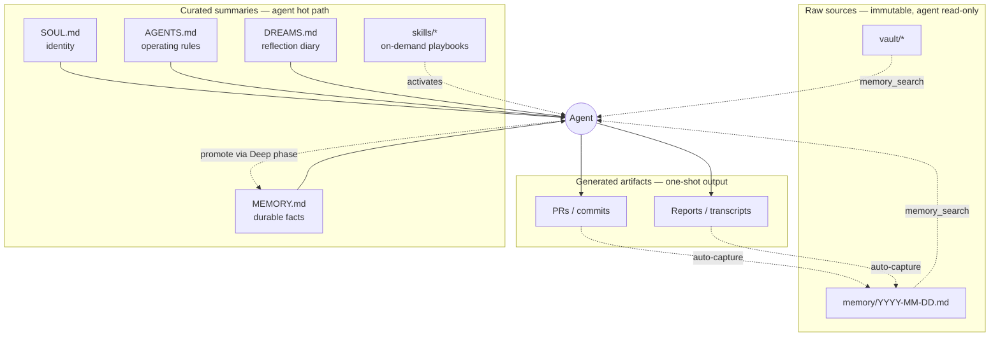

# Part 31: The LLM Wiki Pattern In OpenClaw

> New in the April 2026 refresh. Andrej Karpathy published the "LLM Wiki" pattern in early April 2026 and it caught on fast — 4.3K-view YouTube explainer from Karpathy himself, plus a pile of "we mapped this onto our harness" writeups. The pattern is very close to what OpenClaw's SOUL/AGENTS/MEMORY/skills hierarchy already does. This part makes the mapping explicit.

> **Read this if** you're shipping a production OpenClaw deployment and want a principled answer to "what goes in which file?"
> **Skip if** your MEMORY.md is healthy, your SOUL.md is under 1 KB, and you're not losing context between sessions.

## What Karpathy Proposed

From the April 2026 gist and YouTube walkthrough: a production LLM system needs a **three-tier memory model**, each tier with a different owner, a different update cadence, and a different read path.

| Tier | What it is | Who writes it | Who reads it | Update cadence |
|------|-----------|----------------|--------------|----------------|
| **Raw sources** | Canonical, immutable source of truth. Code, docs, tickets, transcripts. | Humans + ingest pipelines | Agent (read-only) | Whenever new stuff happens |
| **Curated summaries** | Distilled, model-maintained knowledge. "What we've learned about X." | Agent (self-edited) + humans | Agent (hot path) | After sessions, after dreaming, after research |
| **Generated artifacts** | Outputs the agent produces for the user. Code, PRs, reports, decisions. | Agent | Humans | Per task |

The trap every naive implementation falls into: **conflating the three tiers**. Agents that read raw logs as if they were curated facts spend 80% of their context budget on noise. Agents that write summaries to the raw-sources layer corrupt their own ground truth. Agents that output artifacts back into the curated layer inflate it until the hot path is useless.

## The OpenClaw Mapping

OpenClaw's file hierarchy predates Karpathy's framing but maps to it almost 1:1:

| Karpathy tier | OpenClaw path | Injected? | Notes |
|---------------|---------------|-----------|-------|
| **Raw sources** | `vault/` (source notes, transcripts, links) | No (searched on demand) | The `memory_search` tool indexes this. Never written to by the agent except via auto-capture. |
| **Raw sources** | `memory/YYYY-MM-DD.md` (daily rollups) | No (retrieved via `memory_search`) | Short-term buffer. Fed to dreaming. |
| **Curated summaries** | `SOUL.md` (identity, invariants) | Yes — every message | Who the agent is. Rarely changes. |
| **Curated summaries** | `AGENTS.md` (operational rules) | Yes — every message | How to operate. Changes with new patterns. |
| **Curated summaries** | `MEMORY.md` (durable facts) | Yes — every message | Promoted from short-term via the Deep-phase sweep. |
| **Curated summaries** | `DREAMS.md` (reflection diary) | Partial (most-recent entries) | Written by built-in dreaming. Human-readable narrative. |
| **Curated summaries** | `skills/*` (named playbooks) | On demand | When a specific skill activates. |
| **Generated artifacts** | PRs, commits, transcripts, reports | Not re-read by default | The output side of the loop. |

In Karpathy's terms, OpenClaw's "hot path context" = SOUL + AGENTS + MEMORY + the top-N dreams. Everything else is either *retrieved on demand* (raw sources) or *emitted outward* (artifacts).

## The Update Rules

Each tier has a different write pattern. Getting this wrong is the #1 cause of "my OpenClaw deployment works great for a week and then degrades."

### Raw sources (`vault/`, `memory/YYYY-MM-DD.md`)

- **Append-only.** Never rewrite. Never delete a dated file.
- **No agent editing.** Write via the auto-capture hook ([Part 11](./part11-auto-capture-hook.md)) or human edits. The agent's job is to *search* this, not to curate it.
- **Index, don't inject.** Bounded by Ollama-backed vector search, not by the prompt. See [Part 4](./README.md#part-4-memory-stop-forgetting-everything).

### Curated summaries (`SOUL.md`, `AGENTS.md`, `MEMORY.md`, `DREAMS.md`, `skills/`)

- **Size-capped.** SOUL < 1 KB, AGENTS < 2 KB, MEMORY < 3 KB (pointer index — the actual durable facts live in `vault/` and are pulled on demand), DREAMS latest-N entries only. Above the cap, the Deep-phase sweep promotes and prunes.
- **Model-maintained, human-audited.** Dreaming writes MEMORY.md; humans skim it weekly to delete anything wrong.
- **Single-writer per file.** The agent writes MEMORY.md via `memory promote`. Humans write SOUL.md/AGENTS.md. Don't cross these streams.

### Generated artifacts (PRs, commits, reports)

- **One-shot.** Emit, don't re-read. If the agent needs to reference a past PR, it searches `vault/` for the corresponding note, not the artifact itself.
- **Git-anchored.** Commit SHAs and PR numbers are stable pointers; artifact bodies may have moved.
- **Never feed back into the curated layer directly.** Always go through a dreaming or auto-capture pass.

## Why This Matters In Practice

Three failure modes the tier discipline prevents:

### Failure 1 — "Memory bloat"

SOUL.md creeps from 1 KB to 14 KB over a month because the agent keeps appending "I learned X" directly into it. Every message now carries 14 KB of low-signal text. Fix: `MEMORY.md` is for durable facts, `SOUL.md` is for identity/invariants. Move claims. The Deep-phase sweep will re-promote the ones that matter.

### Failure 2 — "Curated-layer corruption"

Agent edits `memory/2026-04-15.md` to "correct" something it saw there. Tomorrow's dreaming pass scores the now-corrupted entry. Now MEMORY.md has an incorrect promoted fact. Fix: raw sources are read-only to the agent. Write corrections to `memory/corrections.md` or to MEMORY.md directly; let the next Deep-phase sweep reconcile.

### Failure 3 — "Artifact feedback loop"

Agent reads yesterday's PR description as if it were a decision record, then re-emits it into today's commit message, then reads *that* as context tomorrow, then re-emits it… Fix: PRs are outputs, not inputs. If a PR contained a decision that should be durable, write the decision to MEMORY.md explicitly.

## The Diagram

Four edges only. No feedback into the raw-sources tier. No direct edits from artifacts into curated. Promotion from raw to curated happens exclusively through dreaming.

## Putting It All Together

Weekly audit. 10 minutes:

1. **Size check.** `wc -c SOUL.md AGENTS.md MEMORY.md`. Any over cap? Something's leaking.
2. **DREAMS.md scan.** Read the last 3 entries. Do they reflect actual recent work? If not, Deep-phase signals may be mistuned ([Part 22](./README.md#part-22-built-in-dreaming)).
3. **MEMORY.md skim.** Any entry you'd object to? Delete. The next Deep-phase sweep will re-promote if it's durable.
4. **Artifact lookup.** Pick a recent PR. Search `vault/` for a corresponding note. If there isn't one, your auto-capture hook isn't firing.

The pattern is simple. The discipline is everything.

## Further Reading

- Andrej Karpathy — LLM Wiki pattern walkthrough, YouTube (Apr 10, 2026, 4.3K views). The canonical source for the three-tier framing.
- *[Karpathy's Pattern For An LLM Wiki In Production](https://aaronfulkerson.com/2026/04/12/karpathys-pattern-for-an-llm-wiki-in-production/)* — Aaron Fulkerson, Apr 12, 2026. Extends the pattern with concrete file-layout proposals.
- *[AaronRoeF/claude-code-patterns](https://github.com/AaronRoeF/claude-code-patterns)* — 153 curated patterns for Claude Code / OpenClaw including the LLM Wiki variant.
- *[Amit Ray — CLAUDE.md vs AGENTS.md vs MEMORY.md vs SKILLS.md vs CONTEXT.md](https://amitray.com/claude-md-vs-agents-md-memory-md-skills-md-context-md-guide-2026/)* — Apr 14, 2026. The "most devs don't know which file is which" deep-dive.

## See Also

- [Part 2 — Context Engineering](./README.md#part-2-context-engineering--the-discipline) — why the hot path has a budget.
- [Part 4 — Memory](./README.md#part-4-memory-stop-forgetting-everything) — the three memory stores and how they compose.
- [Part 9 — Vault Memory System](./part9-vault-memory.md) — the filesystem layout for the raw-sources tier.
- [Part 11 — Auto-Capture Hook](./part11-auto-capture-hook.md) — how generated artifacts re-enter the raw layer safely.
- [Part 22 — Built-In Dreaming](./README.md#part-22-built-in-dreaming) — the promotion pipeline from raw → curated.
